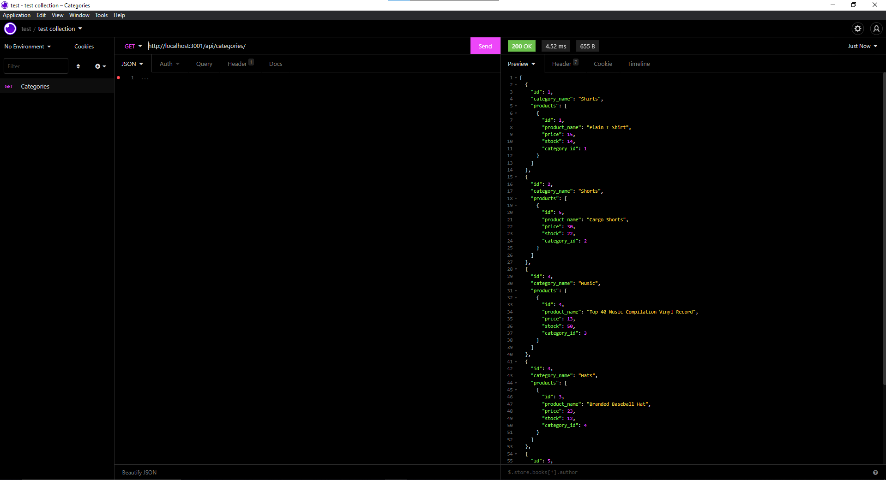
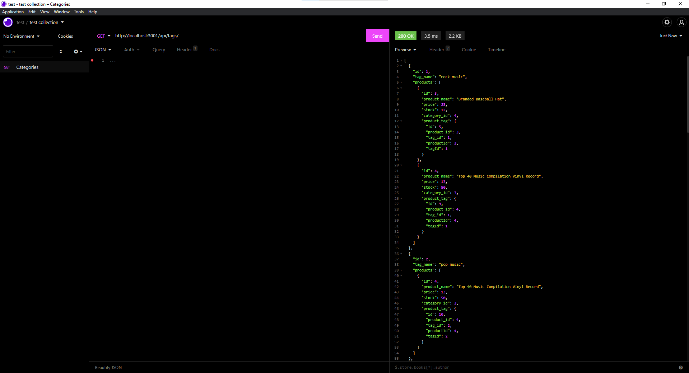
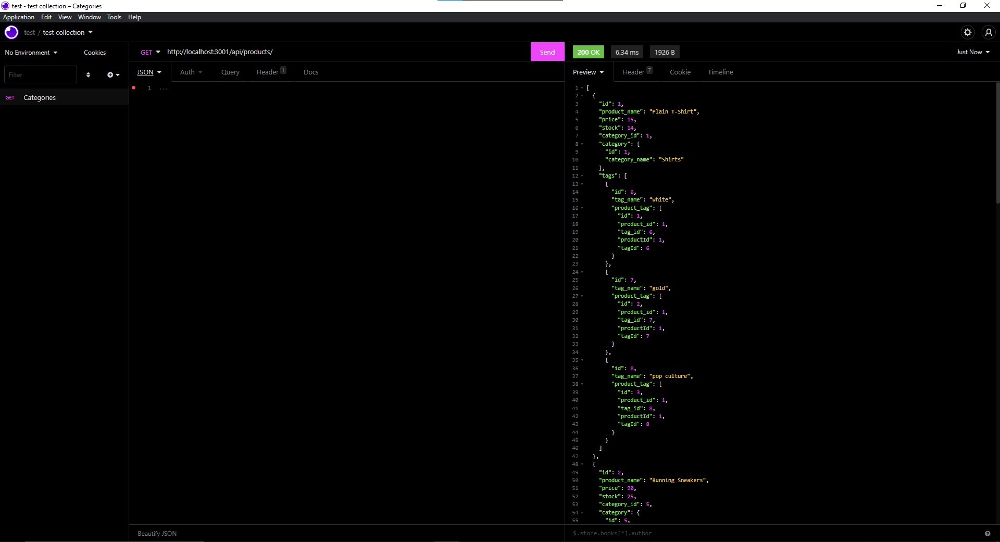

# ecommerce-backend

## Description

This is an e-commerce application's back-end. It interacts with an MSQL database using Express and Sequelize to obtain, create, edit, and remove products, categories, and tags.

A video walkthrough has been recorded to demonstrate its functions. 

> Github Repository Link: [https://github.com/nevan-dsouza/ecommerce-backend](https://github.com/nevan-dsouza/ecommerce-backend)
>
> Video Link for Setup: [https://youtu.be/EV9-DRDsr18](https://youtu.be/EV9-DRDsr18)

## Table of Contents

1. [Installation](#installation)
2. [Usage](#usage)
3. [Example](#example)
4. [License](#license)
5. [Questions](#questions)

## Installation

Type "npm install" in the console to install the dependancies this application requires (Express, MySQL2, Dotenv, and Sequelize). You would also need a MySQL server running to be able to create the database and seed it with items. 

## Usage

There are a few things that must be done in order to run this software. To begin, the user must log into their mySQL server ("mySQL -u root -p" in a terminal), then type "source./db/schema.sql" in a terminal. Second, in another terminal, type "node./seeds/index.js" to seed the database. To start the server, type "npm start." Objects will now be shown at localhost:3001/api/. Examine the GET, POST, PUT, and DELETE http methods with a tool like Insomnia.

## Example

### Screenshots of the Program Running

### Video Demonstration

#### Setting up

https://youtu.be/EV9-DRDsr18

#### Testing Routes

https://youtu.be/B9nPTczF2rw

## License

This project is not under any license.

## Questions

My GitHub Page: [nevan-dsouza](https://github.com/nevan-dsouza)
